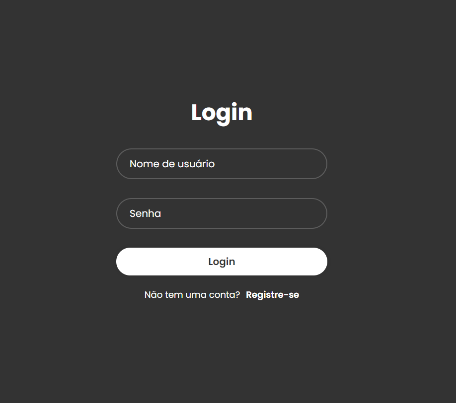
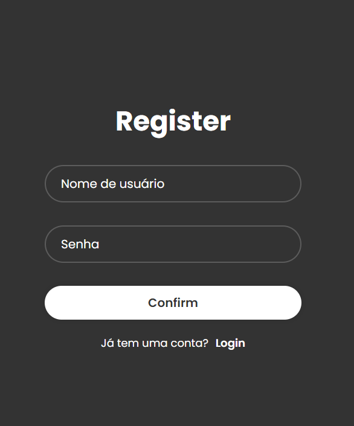
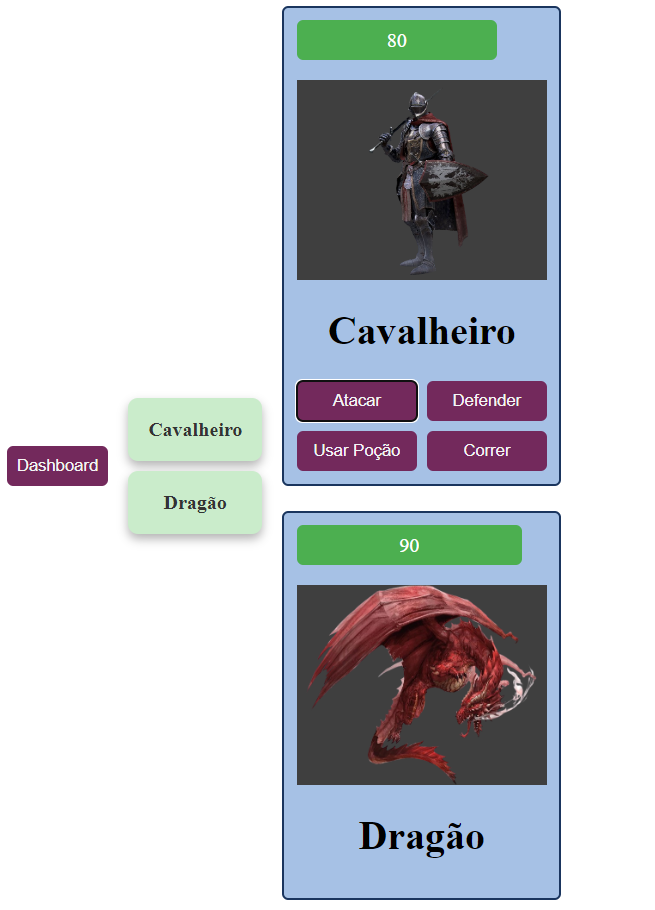
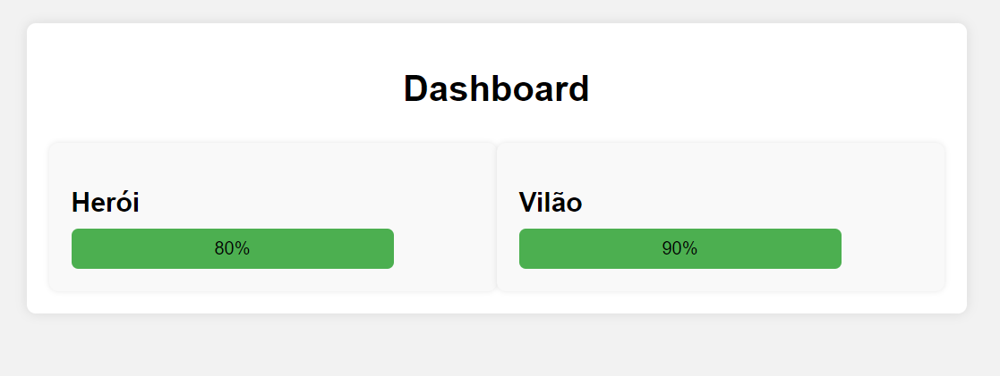

# 2º Bimestre [Trabalho 4] Aplicação Web com BD Relacional

## Este trabalho foi realizado utilizando Vue, Node, Html, Css e JavaScript. O mesmo consiste em um jogo funcional que atraves de uma Api se comunica com o banco de dados, abaixo se encontram imagens do mesmo em todas suas telas :

## Login :

## Cadastro de usuário:

## O Jogo :

## Dashboard :

## Para poder rodar o jogo localmente deve-se instalar as seguintes dependencias :
### Back-end (Node.js):

#### express
#### path
#### mssql
#### cors
#### bcrypt

### Front-end (Vue.js):

#### vue@3

## Vídeo de funcionamento do dashboard e log de ataques dos personagens:
### Devido a um problema no render o mesmo nao esta aceitando os commits de correção do dashboard e de algumas outras funções, ocasionando na versao que esta na nuvem ser mais antiga que a que esta nos arquivos do gitHub, rodando localmente o dashboard eo o jogo todas as funções são executadas normalmente assim como no video abaixo:

#### https://vimeo.com/956732543?share=copy

## A aplicação pode ser acessada pelo link : 
#### https://aplicacao-web-com-bd-relacional.onrender.com
